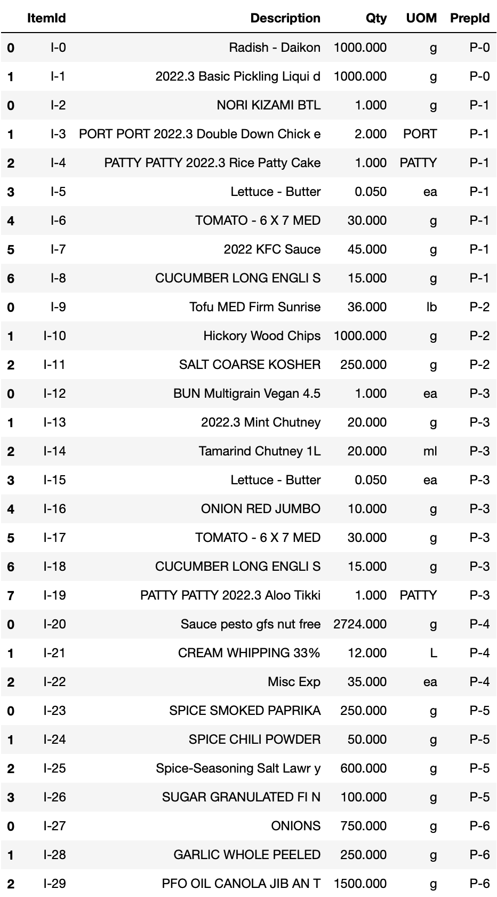
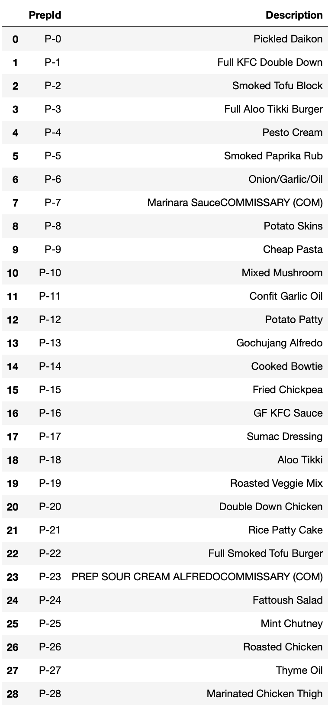

# AMS (2022)

#### Contents
0. Data Structure
1. Items, Child Products, and Products
2. Explaining Workflow
3. Final Outcome

### 0. Data Structure

All recipes are derived from the **Flavour Lab** located in UBC Vancouver Campus. All data files are provided in **PDF formats**. Original recipe data can be found under `./data/AMS`. 

### 1. Items, Child Products, and Products

- `Items`: Independent ingredients that are used in cooking a product. Each item is given its own **item number** (*e.g.*, I-0...) and is marked to belong to the specific recipe under the corresponding **product number** (*e.g.*, P-0...). 

- `Products`: Independent ingredients that are used in cooking a product. Each item is given its own **item number** (*e.g.*, I-0...) and is marked to belong to the specific recipe under the corresponding **product number** (*e.g.*, P-0...). 

