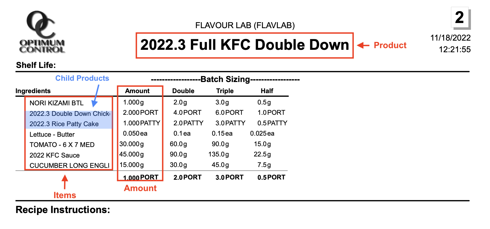
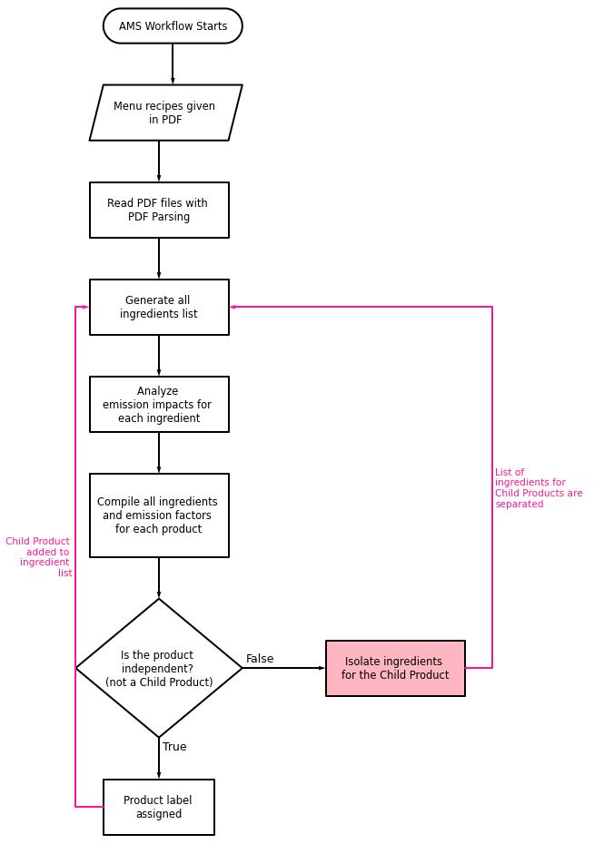
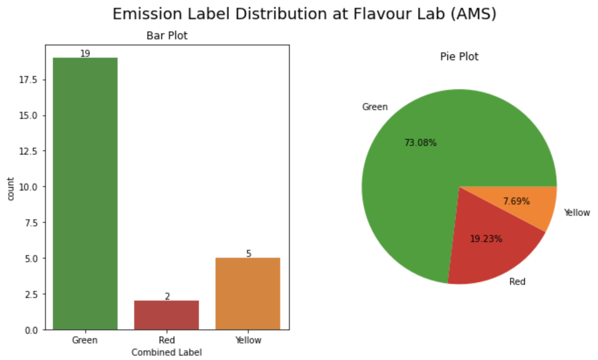

# AMS (2022~2023)

#### Credits:
- Product recipe provided by: **Flavour Lab** at UBC Vancouver
- Workflow generated by: **Jenny Lee** 

#### Contents:
0. Data Structure
1. Items, Child Products, and Products
2. Explaining Workflow
3. Final Outcome

---

## 0. Data Structure

All recipes are derived from the **Flavour Lab** located in UBC Vancouver Campus. All data files are provided in **PDF formats**. Original recipe data can be found under `./data/AMS`. 

## 1. Items, Child Products, and Products

| ItemId        | Description       | Qty  | UOM | PrepId |
| -------------: |-------------:| -----:| -----:| -----:| 
| I-0      | Radish-Daikon | 1000.000 | g | P-0 |
| I-1      | 2022.3 Basic Pickling Liquid      |   1000.0 | g | P-0 |
| I-2 | Nori Kizami BTL      |   1.0 | g | P-1 |
| I-3 | 2022.3 Double Down Chicken      |   2.0 | PORT | P-1 |
| I-4 | 2022.3 Rice Patty Cake      |   1.0 | PATTY | P-1 |

- `Items`: Independent ingredients that are used in cooking a product. Each item is given its own **item number** (*e.g.*, I-0...) and is marked to belong to the specific recipe under the corresponding **product number** (*e.g.*, P-0...). 

| PrepId        | Description       | 
| -------------: |-------------:| 
| P-0      | Pickled Daikon | 
| P-1      | Full KFC Double Down      |  
| P-2 | Smoked Tofu Block      |   
| P-3 | Full Aloo Tikki Burger      |   
| P-4 | Pesto Cream      |   

- `Products` (aka "Preps"): Products that are made with **ingredients**. **Child products** are also included in this list. 

| ItemId        | Description       | Qty  | UOM | ProdId | PrepId |
| -------------: |-------------:| -----:| -----:| -----:| -----:| 
| I-3      | 2022.3 Double Down Chicken  | 2.0 | PORT | P-1 | P-20 |
| I-4      | 2022.3 Rice Patty Cake      |   1.0 | PATTY | P-1 | P-21 |
| I-13 | 2022.3 Mint Chutney    |   20.0 | g | P-3 | P-25 |
| I-19 | 2022.3 Aloo Tikki     |   1.0 | PATTY | P-3 | P-18 |
| I-58 | 2022.3 Thyme Oil |   1000.0 | g | P-10 | P-27 |

- `Child Products`: Products that are used in making another product. From the above dataset, child products are identified under **PrepId**, and corresponding parent products are idenfieid under **ProdId**. For example, item number I-3, Double Down Chicken, is equal to P-20 and will ultimately be used in making P-1, Full KFC Double Down.
  - Child products are usually identified by the keyword "2022.3" included in their description. 

## 2. Explaining Workflow

Files used in this workflow: 
- `AMS_workflow.ipynb`
- `AMS_main.py` (all relevant functions are found under `functions` folder)

#### Process:
1. Generate all ingredients, products, and child products list as shown in `AMS_workflow.ipynb`. (**Step 1** in the document)
2. Undergo unit conversion process as in `functions/AMS_data_cleaning.py`. 
3. Match all ingredients with GHG emission factors, nitrogen generation factors, and water withdrawal factors as in `functions/AMS_mapping.py`.
4. Perform additional data cleaning as shown in **Step 2** of `AMS_workflow.ipymb`.
5. Assign impact factors for all ingredients.
6. Collect impact factors for all products, re-weigh them based on 100g of each product, and assign emission labels. 

## 3. Final Outcomes
In total, **26 products** are analyzed. Distribution is as follows:
| Label       | Label Counts       | Percentage  | 
| -------------: |-------------:| -----:| 
| Green      | 19 | 73.077 % | 
| Yellow      | 5 | 19.231 % | 
| Red      | 2 | 7.692 % |

Plots are generated in `AMS_workflow.ipynb` at **Step 3: Summary and Visualization**. 
